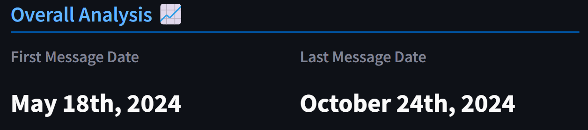
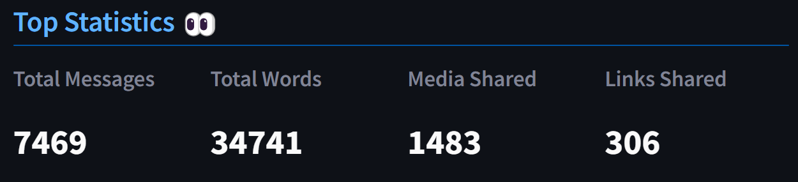
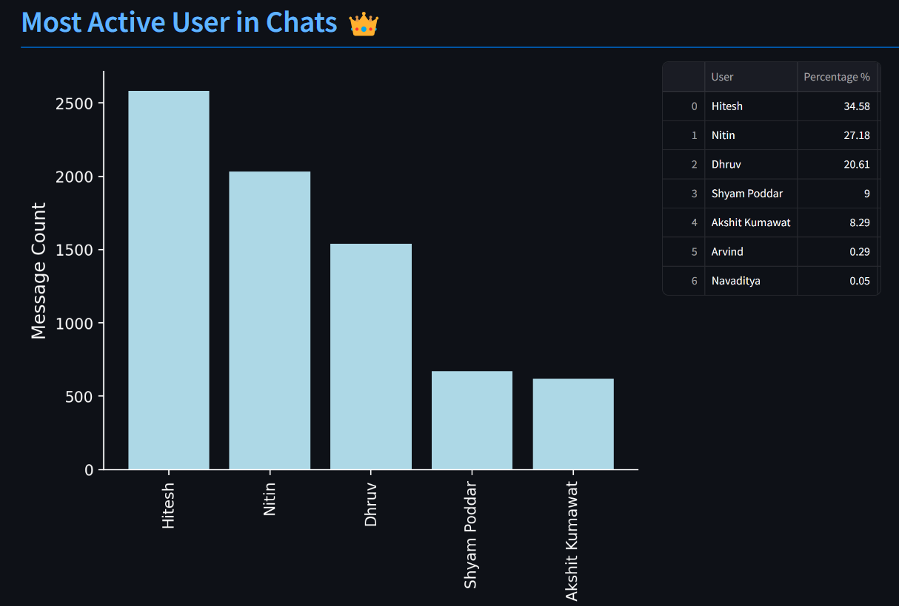
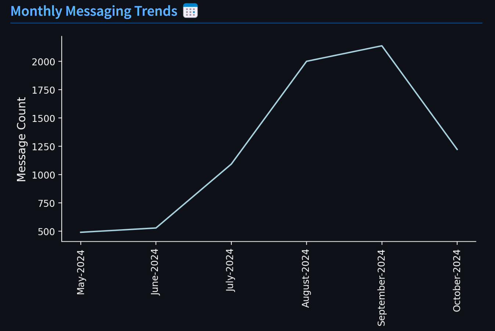
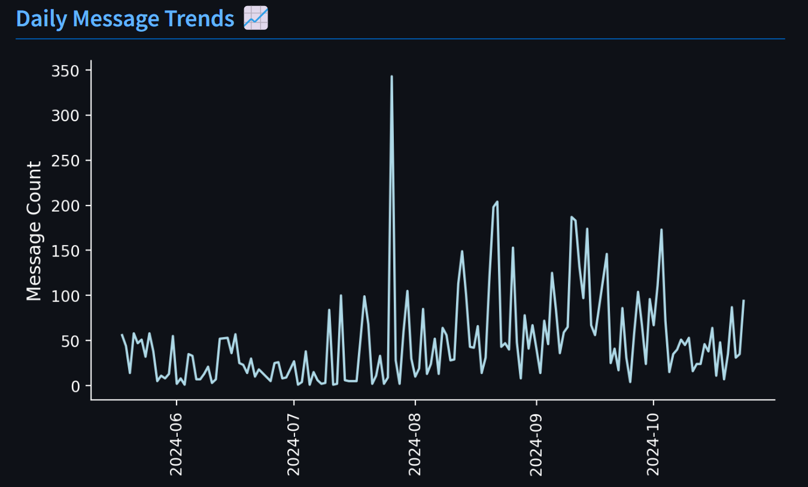
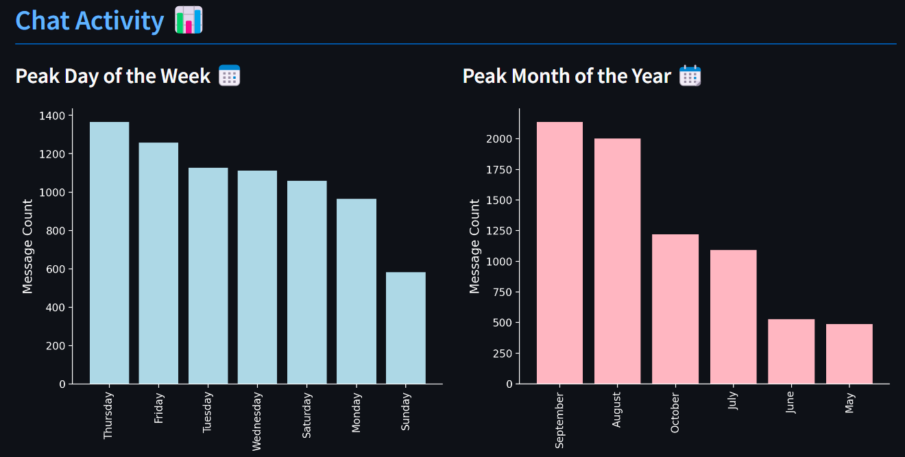
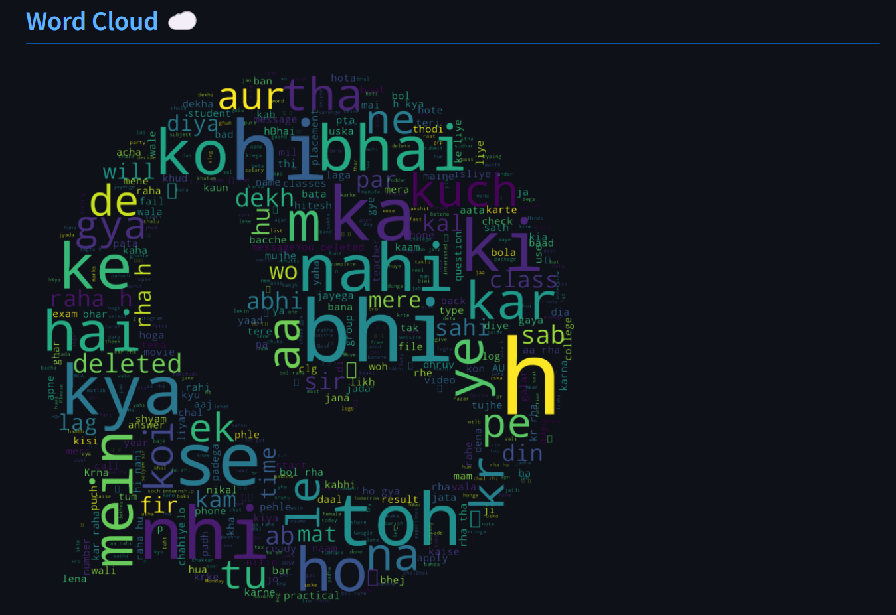
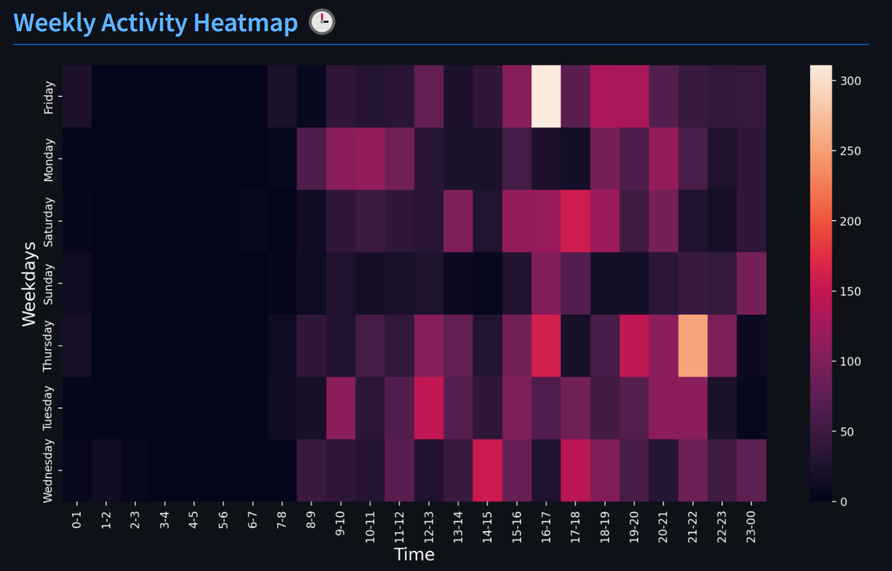
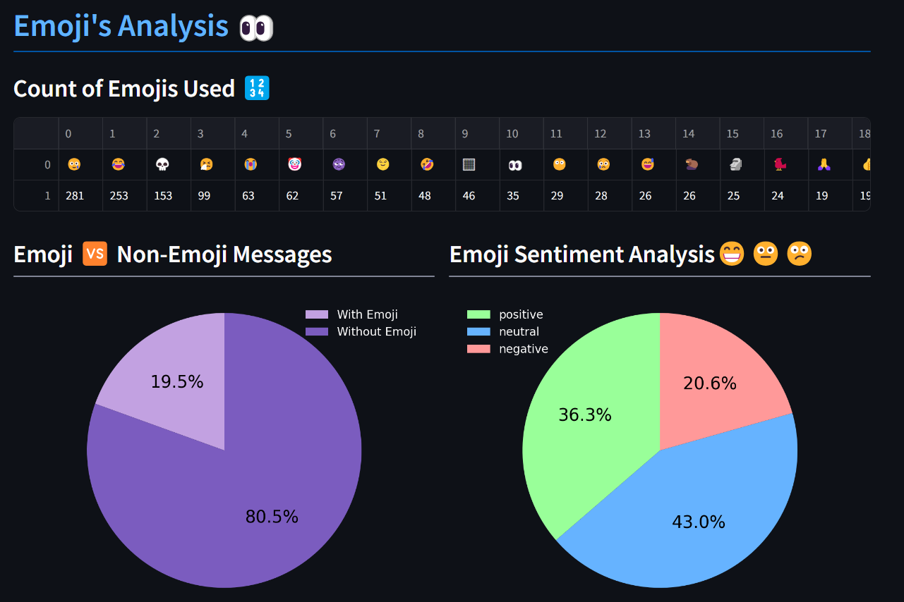
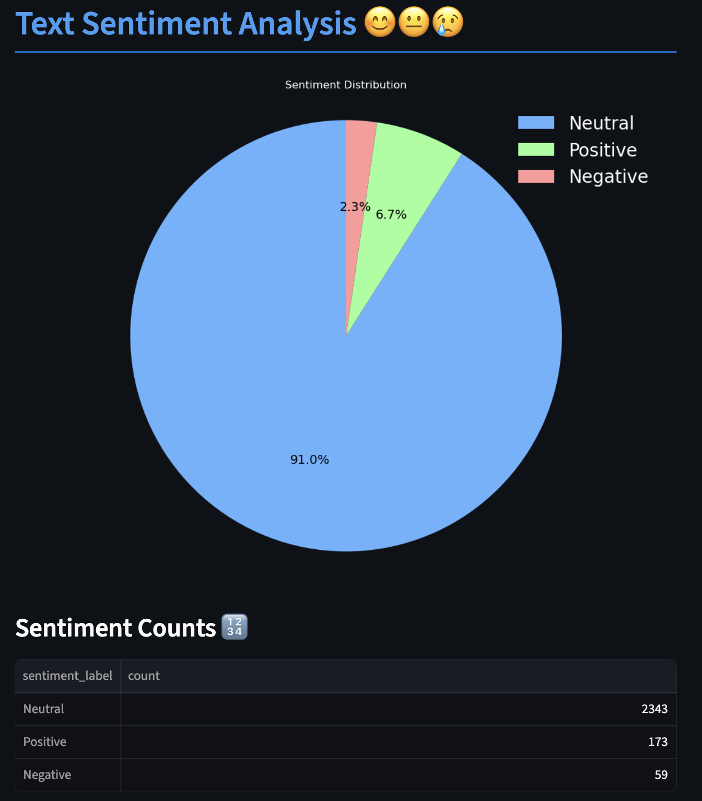

# ChatSense🔢📊

This project offers a comprehensive toolkit for analyzing WhatsApp chat exports, using Python to process chat logs and deliver insightful statistics and visualizations. Key features include an overview of top chat statistics, identification of the most active users, analysis of monthly and daily messaging trends, peak day and month insights, word clouds, a weekly activity heatmap, emoji usage, emoji sentiment analysis, and text sentiment analysis. Designed for exploring communication patterns, this tool enables in-depth insights for both individual and group WhatsApp conversations.

_Note: Please download the WhatsApp chat export without media for optimal results._

## Features

### 📅 First & Last Message Dates



This section displays the date of the first and last messages in the selected chat, giving insight into the duration of the conversation history.

### 👀 Top Statistics



This section highlights the core statistics of the chat, including:

- Total Messages: Count of all messages sent.
- Total Words: Total number of words in all messages.
- Media Shared: Number of media files (images, videos, etc.) shared.
- Links Shared: Count of shared URLs.

### 👑 Most Active User in Chats



Creating a bar graph to display the top 5 most active members, alongside a table showing all group members and their respective percentage contributions to the chat on the right. The x-axis displays the usernames and the y-axis shows the message count.

### 📅 Monthly Messaging Trends



This section provides insights into messaging activity over time on a monthly basis. The line graph displays the message count for each month, allowing you to identify peaks and patterns in messaging behavior. X-axis represents time (months) and y-axis represents message count.

### 📈 Daily Message Trends



Here, you can view the daily messaging trends, with a line graph plotting the message count for each day. This feature is useful for pinpointing specific days of heightened activity, such as holidays or important events. X-axis represents dates and y-axis represents message count.

### 📊 Chat Activity



The Chat Activity section includes two visualizations:

1. **Peak Day of the Week 📅** - A bar graph displays the number of messages sent on each day of the week, helping to identify the days with the highest chat activity.
2. **Peak Hour of the Day ⏰** - This bar chart showcases hourly activity levels, indicating the busiest hours in terms of chat messages.

### ☁️ Word Cloud



The Word Cloud feature provides a visual representation of the most frequently used words in the chat. The larger the word, the more often it appears in the messages. This feature is great for understanding dominant topics or themes in the chat.

### 🕒 Weekly Activity Heatmap



The Weekly Activity Heatmap shows the distribution of messages throughout the week and at different times of the day. It visually represents peak activity times, allowing users to see which days and hours are the most active in the chat.

### 👀 Emoji Analysis



The Emoji Analysis provides insights into emoji usage in the chat, including:

- **Count of Emojis Used 🔢** - Displays a table of emojis and their respective counts, showing the most popular emojis used in the chat.
- **Emoji vs. Non-Emoji Messages** - A pie chart shows the proportion of messages with and without emojis.
- **Emoji Sentiment Analysis 😁😐😕** - Sentiment analysis of emojis used in the chat, categorizing them as positive (green), neutral (blue), or negative (red).

### 😊 Text Sentiment Analysis



The Text Sentiment Analysis section provides comprehensive sentiment insights into the chat messages using VADER (Valence Aware Dictionary and sEntiment Reasoner), an open-source sentiment analysis tool. Features include:

- **Sentiment Distribution Pie Chart** - Visual representation showing the proportion of positive, negative, and neutral messages:
  - **Green** - Positive sentiments
  - **Blue** - Neutral sentiments
  - **Red** - Negative sentiments
  - Displays percentages for each sentiment category with a legend showing counts

- **Sentiment Counts Table 🔢** - Detailed table displaying the exact count of messages in each sentiment category, allowing users to understand the overall tone of the conversation.

This feature helps identify communication patterns and emotional tones across individual or group chats.

## Getting Started

To get started with ChatSense, follow the installation guide below to set up the environment and run the application locally.

### Prerequisites

Before you begin, ensure you have the following installed on your system:

- Python 3.7 or later
- pip (Python package installer)

### Installation Guide

1. **Clone the Repository**
   Open your terminal and clone the repository using the following command:

   ```bash
   git clone https://github.com/anilrelhan/ChatSense.git
   ```

2. **Navigate to the Project Directory**
   Change into the project directory:

   ```bash
   cd ChatSense
   ```

3. **Install Required Packages**
   Install the necessary Python packages using pip:

   ```bash
   pip install -r requirements.txt
   ```

4. **Download VADER Lexicon (for Sentiment Analysis)**
   The first time you run the application, it will automatically download the VADER lexicon. If needed, you can manually download it by running:

   ```python
   python -c "import nltk; nltk.download('vader_lexicon')"
   ```

5. **Run the Application**
   To start the Streamlit application, run the following command:

   ```bash
   streamlit run app.py
   ```

   The application will open in your default browser at `http://localhost:8501`

## Technologies Used

- **Python 3.7+** - Core programming language
- **Streamlit** - Web application framework
- **Pandas** - Data manipulation and analysis
- **Matplotlib** - Data visualization
- **WordCloud** - Word cloud generation
- **NLTK (VADER)** - Sentiment analysis (open-source)
- **URLExtract** - URL extraction from messages
- **Pillow** - Image processing

## Contributing

If you'd like to contribute to this project, feel free to open an issue or submit a pull request. Contributions are welcome!

## License

This project is licensed under the MIT License - see the LICENSE file for details.

## Acknowledgments

Thank you for taking the time to explore ChatSense! Your feedback and support are greatly appreciated. I hope this project provides valuable insights into your WhatsApp communication patterns. Special thanks to the open-source community for tools like NLTK, Streamlit, and Pandas. If you have any questions or suggestions, feel free to reach out.